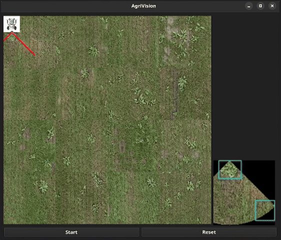

# AgriVision

Proof of Concept for weed detection using advanced image recognition techniques.



## Description

This project is a lightweight application that allows users to control a simple mobile robot for navigation and weed detection. Powered by a custom neural network (YOLOv8), it detects the position of objects within the robot's field of view. This real-time object detection is optimized for running on a CPU, providing an efficient and streamlined solution.

Please note, this is a basic implementation aimed at illustrating the concept of automated weed detection and navigation.

## Installation

```sh
# Clone this repository
git clone https://github.com/Arbrone/agri-vision.git
cd agri-vision

# Install required dependencies
pip install -r requirements.txt

# Launch the app
python3 src/main.py
```

## Shortcuts

|Key|Action|
|:----:|:----:|
|R|reset|
|Q|quit|
|← ↓ ↑→|move|
